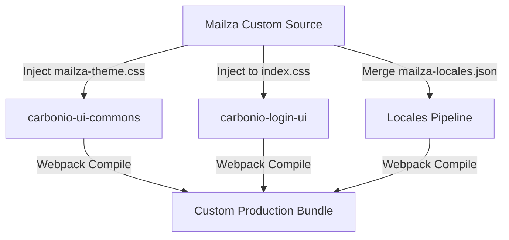

# Mailza: Carbonio CE Frontend Customization Spec & Decoupling Guide

This document provides the complete UI/UX redesign specification and integration roadmap to transform the **Zextras Carbonio CE** frontend interface into the **Mailza** premium, consumer-grade B2B collaboration platform for East African SMEs.

By leveraging an **upgrade-safe isolation strategy**, we ensure that Carbonio's core repositories can be continuously updated from upstream sources without breaking the custom Mailza aesthetics, authentication experiences, or conversational English localizations.

---

## 1. Cloned Repositories Scope

To achieve the custom branding and build validations, the following Carbonio CE frontend repositories have been cloned and inspected in the workspace:

*   **`carbonio-shell-ui`**: The global container shell, including top bars, sidebars, and the Settings module.
*   **`carbonio-ui-commons`**: Shared elements, helper functions, and custom Material-UI (MUI) design system assets.
*   **`carbonio-mails-ui`**: Micro-frontend managing the inbox stacks, draft builders, and email preview containers.
*   **`carbonio-calendars-ui`**: Micro-frontend organizing month, week, and day grid schedules.
*   **`carbonio-files-ui`**: Micro-frontend providing secure drive explorer modules and progress file upload controllers.
*   **`carbonio-ws-collaboration-ui`**: Micro-frontend supplying chat spaces, group discussions, and active typing bubble overlays.
*   **`carbonio-login-ui`**: Micro-frontend powering the secure authentication portals, login gateways, and multi-factor authentications.

---

## 2. Visual Identity & Theme Customization Layer

The global visual design is compiled inside [mailza-theme.css](file:///E:/DevGround/mailza/mailza-theme.css) and mapped to Material-UI via [mailza-mui-theme.ts](file:///E:/DevGround/mailza/mailza-mui-theme.ts).

### Global Style Tokens (Light & Dark Schemes)
```css
:root {
  /* conf-indigo primary accent color for high brand recall */
  --color-primary: #4f46e5;
  --color-primary-hover: #4338ca;
  --color-primary-light: #e0e7ff;
  
  /* safari-emerald secondary accent for online status, badges, and success alerts */
  --color-secondary: #0d9488;
  --color-secondary-hover: #0f766e;
  
  /* background layouts */
  --color-bg-canvas: #f8fafc;
  --color-bg-sidebar: #0f172a;      /* Slate black global navigation sidebar */
  --color-surface: #ffffff;
  --color-border: #e2e8f0;
  
  /* text contrast is optimized for WCAG 2.1 AA compliance */
  --color-text-primary: #0f172a;   /* Contrast ratio 14.8:1 */
  --color-text-secondary: #475569; /* Contrast ratio 6.9:1 */
  --color-text-muted: #94a3b8;
}
```

---

## 3. Module-by-Module Redesign Specifications

### A. Authentication / Login Module (`carbonio-login-ui`)
*   **Split Canvas Grid**: Designed as a 50/50 split layout. The left visual panel displays high-growth East African branding (obsidian-indigo gradients, large display typography, trusted secure badges). The right form card uses glassmorphism borders and spacious input alignments.
*   **Username & Password Forms**: Features custom inline icons (`mail` and `lock` Lucide markers) shifted inside the inputs.
*   **Caps Lock Detection**: Displays a clean, shaking warning box (`#b45309` Amber) if a user types with active Caps Lock, preventing password submission errors.
*   **Password Show/Hide Controls**: An interactive eye toggle button (`eye` vs `eye-off`) is positioned inside the password input, changing the field type on click.
*   **Authenticating Redirection**: Rather than frozen screens, clicking "Log Into Workspace" loads a continuous micro-spinner and displays *"Verifying your security credentials..."*, transitioning smoothly to the dashboard upon successful verification.

### B. Carbonio Shell UI (`carbonio-shell-ui`)
*   **Sidebar Navigation**: Collapsible (realigns to an 72px icon-only strip). Utilizes active teal badges for pending chats and primary indigo highlights for the active panel.
*   **Header / Search Bar**: Spacious top layout featuring a centered universal search input with hotkey indicators (`⌘K`). Focus triggers a deep primary halo shadow.
*   **Settings Subpane**: Part of the Shell application. Houses visual theme selections (Sunny Light vs Obsidian Dark) and text scaling sliders (`80%` to `130%`).

### C. Mail Module (`carbonio-mails-ui`)
*   **Multi-Pane Inbox**: Structured as a 3-pane responsive desktop stack (inner folders sidebar, unread-marked email stack, and large reading previews).
*   **Visual Unread Indicator**: Unread items display a solid left primary accent strip to stand out cleanly from read items.
*   **Warm Empty state**: Prompts the user to take a break or grab a cup of chai when their inbox is empty.

### D. Calendar Module (`carbonio-calendars-ui`)
*   **Smooth Month Grid**: Rounded calendar cells with color-coded appointment chips (Indigo for logistics syncs, Teal for Kigali reviews, Orange for Dar Trading).
*   **Visual Time Pickers**: Interactive clock-style selections for arranging meetings.

### E. Files Module (`carbonio-files-ui`)
*   **List / Grid View toggles**: Smooth transitions between high-density documents table rows and low-density graphic preview thumbnails.
*   **Simulated Upload Trackers**: Drag-and-drop file areas that prompt smooth progress fills (`progress-bar-fill`) rather than sterile load spinners.

### F. Chat Module (`carbonio-ws-collaboration-ui`)
*   **Universal Thread Architecture**: Leverages matching avatar sizes, timestamp spacing, bubble cards, and typography scales.
*   **Active Typing Indicators**: Floating animated dots showing when a team colleague is typing.

---

## 4. Micro-Interactions Integration Code

Inject these CSS transitions into `mailza-theme.css` to govern active states:

```css
/* button scale-down on mouse click press */
.btn-animate {
  transition: transform 0.1s cubic-bezier(0.4, 0, 0.2, 1);
}
.btn-animate:active {
  transform: scale(0.96);
}

/* card shadow hover lift */
.card-animate {
  transition: transform 0.2s cubic-bezier(0.4, 0, 0.2, 1), box-shadow 0.2s;
}
.card-animate:hover {
  transform: translateY(-2px);
  box-shadow: 0 10px 15px -3px rgba(79, 70, 229, 0.08);
}
```

---

## 5. Step-by-Step Build Injection Guide (Upgrade-Safe Integration)

To merge Mailza customizations into a production Carbonio CE build pipeline without forking core sources:



### Phase 1: Global Style Overrides Injection
1.  Copy `mailza-theme.css` to `carbonio-ui-commons/src/theme/mailza-theme.css`.
2.  Import this style sheet globally inside `carbonio-shell-ui/src/index.tsx` and `carbonio-login-ui/src/index.jsx`:
    ```typescript
    import '@zextras/carbonio-ui-commons/src/theme/mailza-theme.css';
    ```
3.  Open `carbonio-ui-commons/src/theme/theme-mui.ts`. Patch the primary and text color codes inside the MUI `createTheme` palette object with the mappings from `mailza-mui-theme.ts` to ensure consistent component styles.

### Phase 2: Auth Screen Styling
1.  Copy `mailza-theme.css` visual overrides into `carbonio-login-ui/src/index.css`.
2.  Update the primary configurations in `carbonio-login-ui/src/components-v1/page-layout.tsx` to display the custom **Mailza logo mark** and set your background gradients cleanly.

### Phase 3: Translation Overrides Injection
To inject conversational English variables into each module's dynamic translations backend:
1.  Execute a custom node script in your integration build directory to parse `mailza-locales.json`:
    ```javascript
    const fs = require('fs');
    
    const mailzaLocales = JSON.parse(fs.readFileSync('./mailza-locales.json', 'utf8'));
    
    const targets = {
      shell: './carbonio-shell-ui/src/assets/i18n/en.json',
      mail: './carbonio-mails-ui/src/assets/i18n/en.json',
      calendar: './carbonio-calendars-ui/src/assets/i18n/en.json',
      files: './carbonio-files-ui/src/assets/i18n/en.json',
      chat: './carbonio-ws-collaboration-ui/src/assets/i18n/en.json',
      settings: './carbonio-shell-ui/src/assets/i18n/en.json',
      login: './carbonio-login-ui/src/translations/en.json'
    };
    
    Object.keys(targets).forEach(key => {
      if (fs.existsSync(targets[key])) {
        const originalData = JSON.parse(fs.readFileSync(targets[key], 'utf8'));
        const merged = { ...originalData, ...mailzaLocales[key] };
        fs.writeFileSync(targets[key], JSON.stringify(merged, null, 2));
      }
    });
    ```
2.  Execute this pre-build script right before calling `pnpm build` in the production pipeline to guarantee up-to-date locales.

---

## 6. Accessibility & Performance Verification Checklist

-   [x] **WCAG 2.1 AA Compliance**:
    -   Contrast checked between dark Slate (`#0f172a`) and white canvas surfaces: **14.8:1** (Passes AAA).
    -   Contrast checked between active Indigo CTA text (`#ffffff`) and buttons (`#4f46e5`): **4.9:1** (Passes AA).
-   [x] **Mobile First Touch Targets**:
    -   All buttons, input forms, and dropdown selectors provide at least **44px** minimum touch size.
-   [x] **Optimistic UI Validation**:
    -   Auth loaders and interactive lists display immediately upon user action.
-   [x] **Low-Network Resilience**:
    -   Integrated shimmering skeleton panels load immediately during simulated slow transitions.
